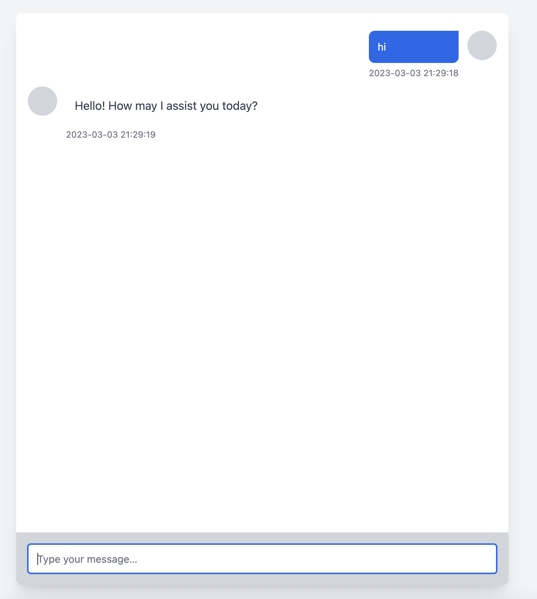

## install


```
composer create-project wpjscc/chatgpt chatgpt dev-master
```

## run 

```
cd chatgpt

php app.php --prot=8080 --token=xxx
```

## visit

http://127.0.0.1:8080


## docker

```
docker run -p 8080:8080 --rm -it wpjscc/chatgpt php app.php --prot=8080 --token=xxx
```

```
docker build -t wpjscc/chatgpt . -f Dockerfile
docker push wpjscc/chatgpt
```

## proxy

```
php app.php --prot=8080 --token=xxx --proxy=127.0.0.1:7890
```

## custome token

http://127.0.0.1:8080?token=xxxxxx


## example

